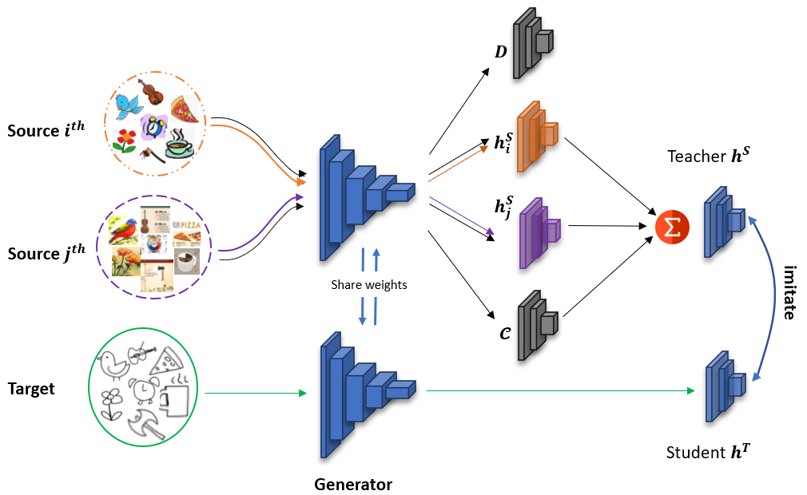

# STEM: An approach to Multi-source Domain Adaptation with Guarantees

<p align="center">
   
</p>

## Introduction
This is the official implementation of [STEM: An approach to Multi-source Domain Adaptation with Guarantees](https://openaccess.thecvf.com/content/ICCV2021/html/Nguyen_STEM_An_Approach_to_Multi-Source_Domain_Adaptation_With_Guarantees_ICCV_2021_paper.html)

### Prerequisites
System Requirement:
* Anaconda3
* Cuda toolkit 10.0

Install other environment requirement by Anaconda3 following:
```
conda env create -f env.yml
```

**Note**: the environment requires `tensorbayes` libs, however, available tensorbayes using Python 2.7. To fix the problem, please download [tensorbayes](https://drive.google.com/file/d/1H5srfetpc0aVABt91-1aVK7ePtP3N5h_/view?usp=sharing), untar it and override to the env (stem) folder:
```
tar -xvf tensorbayes.tar
cp -rf ./tensorbayes/* /opt/conda/envs/stem/lib/python3.6/site-packages/tensorbayes/
```

### Dataset Preparation
Please download and unzip the dataset and save all `*.mat` file under `../datasets`. To save time computing, we extracted ResNet101 feature for Office-Caltech10 and provided as following:

* [Digits-five](https://drive.google.com/file/d/1L7gg22gGsL-vOqS88NLJrciDtczsM9oQ/view?usp=sharing)
* [Office-31](https://drive.google.com/file/d/1Q-ABkNTmw4bMJMKLsDZ0h0WtGvzlzhNc/view?usp=sharing)
* [DomainNet](http://ai.bu.edu/M3SDA/)
  **Note**: Please refer to [this GitHub repo for code on DomainNet](https://github.com/anh-ntv/stem-domainnet_pytorch)

### Training
**Note**: Please refer to [this GitHub repo for code on DomainNet](https://github.com/anh-ntv/stem-domainnet_pytorch)
The config parameter to train model in `config` folder, please check it before run. To train the model, simply run:
```
python run_stem_ht_mimic_hs.py --config <dataset name>.yaml --trg_name <target name>
```

**For example**:  

Train **Digit-five** with target domain is `Synthetic Digits`:
```
python run_stem_ht_mimic_hs.py --config DigitFive.yaml --trg_name syn
```

Train **Office-Caltech10** with target domain is `Amazon`:
```
python run_stem_ht_mimic_hs.py --config OfficeCaltech10.yaml --trg_name amazon
```

## Cite  
Please cite the paper whenever our STEM is used to produce published results or incorporated into other software:

	@InProceedings{Nguyen_2021_ICCV,
    author    = {Nguyen, Van-Anh and Nguyen, Tuan and Le, Trung and Tran, Quan Hung and Phung, Dinh},
    title     = {STEM: An Approach to Multi-Source Domain Adaptation With Guarantees},
    booktitle = {Proceedings of the IEEE/CVF International Conference on Computer Vision (ICCV)},
    month     = {October},
    year      = {2021},
    pages     = {9352-9363}
}
